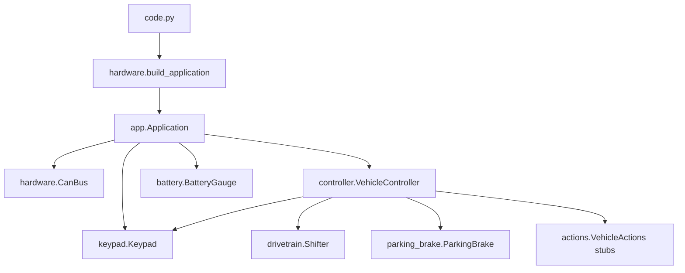
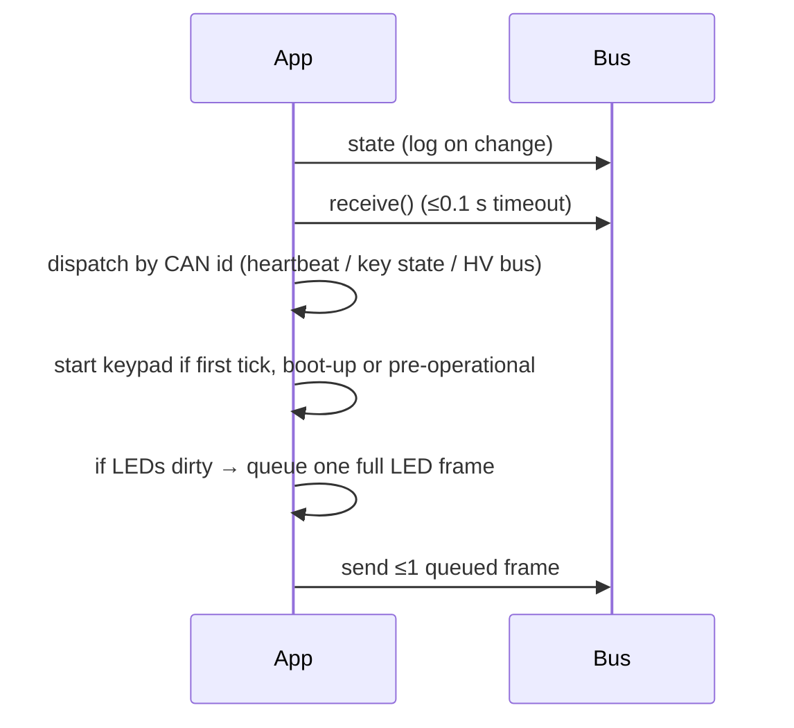

# Firmware architecture

`code.py` is a thin entrypoint. All logic is in the `mmecu/` package, and only
`mmecu/hardware.py` touches CircuitPython hardware modules, so the rest runs
unchanged on CPython under test.

| Module | Owns |
|---|---|
| `code.py` | log level, CAN transceiver wake, `while True: app.tick()` |
| `mmecu/hardware.py` | pin map, `CanBus` (canio wrapper), `build_application(sleep=, clock=, actions=)` |
| `mmecu/app.py` | `Application.tick()`, CAN dispatch table, keypad start lifecycle, `LISTEN_IDS` |
| `mmecu/controller.py` | `VehicleController`: press/release tables for all 12 keys, drive/toggle/mode/cruise state, LED choices, hold timing |
| `mmecu/actions.py` | `VehicleActions` stubs (log-only) for effects not wired yet; `PowerMode` |
| `mmecu/keypad.py` | CANopen IDs, `Key`, `Color`, `NodeState`, key decode, LED encode, `Keypad` model |
| `mmecu/drivetrain.py` | `DriveState`, `Shifter` (blocking relay pulse) |
| `mmecu/parking_brake.py` | `ParkingBrake` (sensor sync at boot, held triggers) |
| `mmecu/battery.py` | 0x126 decode, clamped `charge_fraction`, throttled `BatteryGauge` |
| `mmecu/can.py` | `frame_data` (8-byte padding), `Outbox` FIFO |
| `mmecu/log.py` | syslog-level `print` logging; `event()` structured `EVT` lines for QA ([../qa/summary.md](../qa/summary.md)) |



## One tick


## Contracts
- A tick receives at most one frame and sends at most one. Bursts drain over
  following ticks, in FIFO order.
- Handlers take the raw payload. Decoders return `None` for short payloads and
  the handler logs a warning, so no handler raises on malformed input.
- `Keypad.set_color` only marks LEDs dirty; `Application` sends one coalesced
  full-state LED frame per tick.
- Dependencies are injected. Anything with `.value` can be a pin, anything with
  `.angle` can be the servo, and `sleep`, `clock` (monotonic seconds) and `actions`
  are parameters.

```python
# wiring a test double is just passing objects
Shifter({DriveState.DRIVE: relay}, sleep=fake_clock.sleep)
```

Related: [../platform/hardware.md](../platform/hardware.md), [../testing/summary.md](../testing/summary.md).
