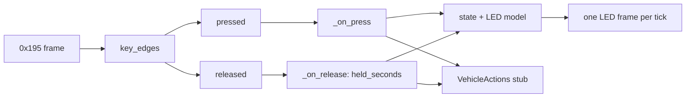

# Button behaviors: requirements vs implementation

Source requirements: [../../REQUIREMENTS.md](../../REQUIREMENTS.md). Every key has a
handler in `mmecu/controller.py`. Effects not yet wired to hardware go through a
**stub** in `mmecu/actions.py` (`VehicleActions`), which only logs `TODO ...` at info.

| Key | Name | Requirement | LED (implemented) | Vehicle effect |
|---|---|---|---|---|
| 1 | HAZARD | toggle; blink yellow 1 s | solid yellow / off (blink: roadmap) | stub `set_hazard(on)` |
| 2 | PARK | drive radio group | blue | engages brake |
| 3 | REVERSE | drive radio group | blue | D11 pulse, releases brake |
| 4 | NEUTRAL | drive radio group | blue | D12 pulse |
| 5 | DRIVE | drive radio group | blue | D13 pulse, releases brake |
| 6 | AUTOPILOT_SPEED_UP | green while held, raise speed by hold time | green while held | stub `adjust_cruise_speed(+1, held_s)` on release |
| 7 | EXHAUST_SOUND | toggle, solid (white?) | solid yellow / off | stub `set_exhaust_sound(on)` |
| 8 | F1 | radio w/ F2: low power + regen | F1 cyan, F2 off | stub `set_power_mode("low")` |
| 9 | F2 | radio w/ F1: high power + regen | F2 yellow, F1 off | stub `set_power_mode("high")` |
| 10 | REGEN | toggle + regen command | white / off (starts off) | stub `set_regen(on)` |
| 11 | AUTOPILOT_ON | toggle openpilot, pulsing blue | solid blue / off | stub `set_cruise(on)` |
| 12 | AUTOPILOT_SPEED_DOWN | orange while held, lower speed | **red** while held | stub `adjust_cruise_speed(-1, held_s)` on release |

Decisions (2026-09-28, by the human):
- Stub keys light their LEDs as the requirements describe, even though the vehicle
  effect is still a stub.
- Releases are dispatched with hold time.

Interpretations: orange is not representable on the key LEDs (1 bit per channel),
so red is used. Cruise is solid rather than pulsing. Regen starts off to match its
dark LED. "Vehicle must be stopped" is not enforced (no speed source).

## Dispatch contract
- `Keypad.key_edges(held)` compares with the previous key-state frame and returns
  `(pressed, released)`. Frames are level snapshots, so held keys never re-trigger.
- After every keypad start, nothing fires until the key baseline is known (SDO read, see
  [can-protocol.md](can-protocol.md)). Keys down at that moment count as held.
- `Application` dispatches releases first, then presses, each in key order 1→12.
- `VehicleController.key_pressed` records a `clock()` timestamp. `key_released` calls
  the key's release handler (if any) with `held_seconds`.
- A keypad (re)start (`keypad_restarted`) abandons holds in progress: hold LEDs go
  dark and no release action fires.



## Implementing a stubbed feature
Fill in the method in `VehicleActions` (e.g. queue a CAN frame or drive a pin). Key
handling, LEDs and tests already call it. Tests use `tests/sim.py:RecordingActions`,
which rejects any name `VehicleActions` does not define.

```python
class VehicleActions:
    def set_regen(self, on):          # was: log.info(f"TODO set_regen({on})")
        self._outbox.push(REGEN_ID, [0x01 if on else 0x00])   # illustrative only
```

Related: [spec-reference.md](spec-reference.md), [can-protocol.md](can-protocol.md), [../vehicle/drive-selection.md](../vehicle/drive-selection.md).
