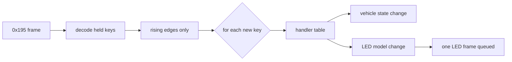

# Button behaviors: requirements vs implementation

Source requirements: [../../REQUIREMENTS.md](../../REQUIREMENTS.md).

| Key | Name | Requirement | Implemented |
|---|---|---|---|
| 1 | HAZARD | toggle; blink yellow 1 s on / 1 s off | toggle, solid yellow / off (no blink) |
| 2 | PARK | drive radio group | blue; engages brake |
| 3 | REVERSE | drive radio group | blue; D11 pulse; releases brake |
| 4 | NEUTRAL | drive radio group | blue; D12 pulse |
| 5 | DRIVE | drive radio group | blue; D13 pulse; releases brake |
| 6 | AUTOPILOT_SPEED_UP | green while held, raise cruise speed | no-op |
| 7 | EXHAUST_SOUND | toggle, solid (white?) | toggle, solid yellow / off |
| 8 | F1 | radio w/ F2, low power + regen | F1 cyan, F2 off (LEDs only) |
| 9 | F2 | radio w/ F1, high power + regen | F2 yellow, F1 off (LEDs only) |
| 10 | REGEN | toggle + send regen command | no-op |
| 11 | AUTOPILOT_ON | toggle openpilot, pulsing blue | no-op |
| 12 | AUTOPILOT_SPEED_DOWN | orange while held, lower speed | no-op |

LED colors are 1-bit per channel: red, green, blue, yellow, cyan, magenta,
white, black (off). "Orange" is not representable.

## Dispatch contract
- Only rising edges are acted on (`Keypad.newly_pressed`). A key-state frame is a level
  snapshot sent on any change, so held keys are never re-triggered.
- Several keys going down in the same frame are handled in key order 1→12.
- Keys with no handler (REGEN, AUTOPILOT_*) are logged at debug and ignored.
- Releases are not dispatched yet; hold-duration features (cruise ±) will need them.



```python
# handlers are an explicit table keyed by key number (see mmecu/controller.py)
self._handlers = {Key.HAZARD: self.toggle_hazard, Key.PARK: self.select_park, ...}
```

Related: [spec-reference.md](spec-reference.md), [can-protocol.md](can-protocol.md), [../vehicle/drive-selection.md](../vehicle/drive-selection.md).
