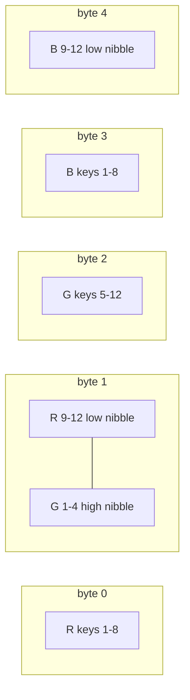
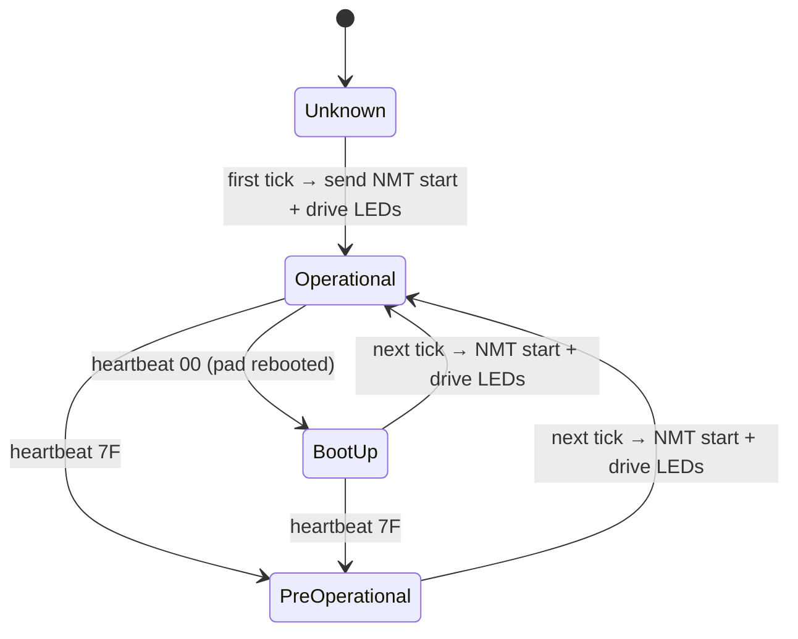

# Keypad CAN protocol (PKP-2600-SI, CANopen)

The keypad is CANopen node `0x15` on a 500 kbit/s bus. All frames the ECU sends
are padded/truncated to 8 data bytes.

| Purpose | COB-ID | Direction | Payload |
|---|---|---|---|
| NMT start (all nodes) | `0x000` | ECU → pad | `01 00 …` |
| Heartbeat | `0x715` (0x700+node) | pad → ECU | `00` boot-up, `7F` pre-operational, `05` operational |
| Key state (TPDO1) | `0x195` (0x180+node) | pad → ECU | bytes 0–1: little-endian bitmask, bit `n-1` = key `n` pressed |
| LED colors (RPDO1) | `0x215` (0x200+node) | ECU → pad | 36-bit little-endian bitfield (below) |

## Key-state bitmask
```python
mask = data[0] | (data[1] << 8)
pressed = [n for n in range(1, 13) if mask >> (n - 1) & 1]
```
The pad reports the *current* set of held keys on every change, so a release
produces an all-zero frame (which the ECU ignores).

## LED bitfield
Red occupies bits 0–11, green 12–23, blue 24–35; within a channel bit `n-1` is key `n`.
```python
value = 0
for n, (r, g, b) in rgb_by_key.items():
    value |= r << (n - 1) | g << (12 + n - 1) | b << (24 + n - 1)
payload = [(value >> (8 * i)) & 0xFF for i in range(5)]
```
Golden example: PARK (key 2) and NEUTRAL (key 4) blue → bits 25, 27 →
`00 00 00 0A 00 00 00 00`.



## Node state machine (ECU view)

Invariant: whenever the ECU (re)activates the pad it re-sends the LED frame,
because a rebooted pad has lost its LED state.

Lesson: the original code pushed one full LED frame per button color change
(4 frames for a drive change). The frame is a full snapshot, so only the last
one matters.

References: datasheet and CANopen manual links are in [../../readme.md](../../readme.md).
Related: [summary.md](summary.md), [button-behaviors.md](button-behaviors.md).
