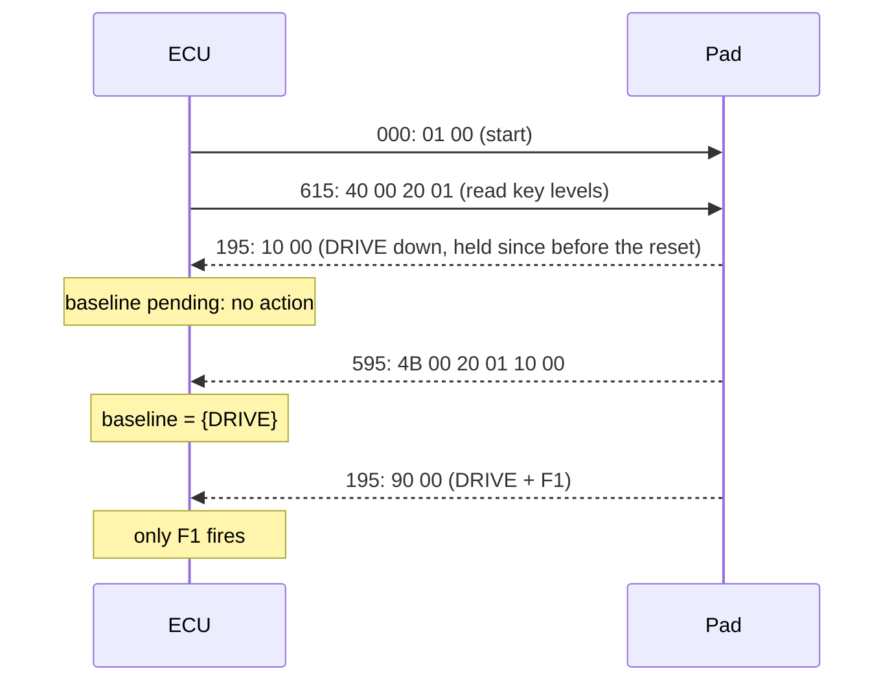
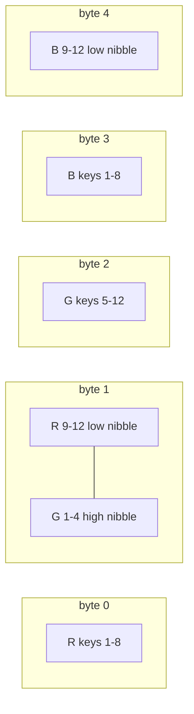
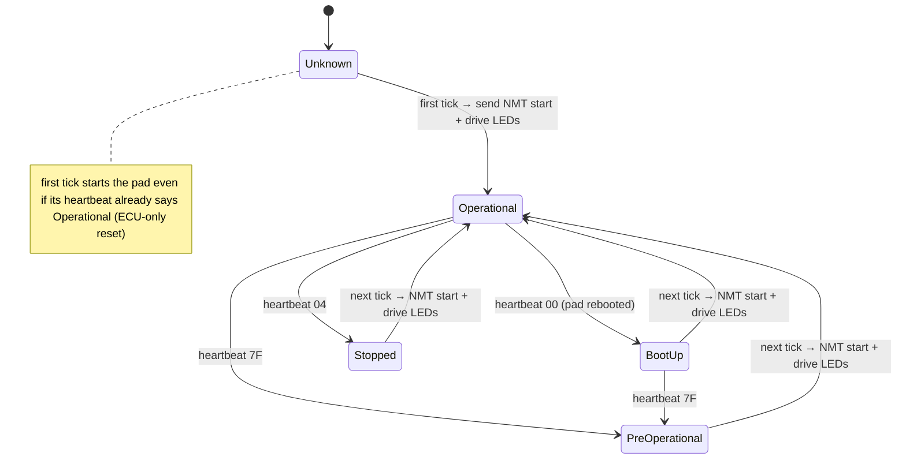

# Keypad CAN protocol (PKP-2600-SI, CANopen)

The keypad is CANopen node `0x15` on a 500 kbit/s bus. All frames the ECU sends
are padded/truncated to 8 data bytes.

| Purpose | COB-ID | Direction | Payload |
|---|---|---|---|
| NMT start (all nodes) | `0x000` | ECU → pad | `01 00 …` |
| Heartbeat | `0x715` (0x700+node) | pad → ECU | `00` boot-up, `04` stopped, `7F` pre-operational, `05` operational |
| Key state (TPDO1) | `0x195` (0x180+node) | pad → ECU | bytes 0–1: little-endian bitmask, bit `n-1` = key `n` pressed |
| LED colors (RPDO1) | `0x215` (0x200+node) | ECU → pad | 36-bit little-endian bitfield (below) |
| Key levels (SDO read 2000h/1) | `0x615` → `0x595` | ECU ↔ pad | `40 00 20 01` → `4B 00 20 01 <b0> <b1>` (same bitmask) |

## Key-state bitmask
```python
mask = data[0] | (data[1] << 8)          # keypad.decode_pressed_keys; None if len < 2
pressed = [n for n in range(1, 13) if mask >> (n - 1) & 1]
```
The pad reports the *level* of every key on every press or release. `Keypad.key_edges`
compares with the previous frame and returns `(pressed, released)`, so a repeated frame
or a second key going down never re-triggers a held key.

### Key baseline after every keypad start
A level frame cannot tell "just pressed" from "held since before a restart". Holding
DRIVE through an ECU reset or keypad reboot and then touching any key used to release
the brake and pulse the drive relay (found by Copilot review, reproduced in the sim).
- Every NMT start also queues an SDO read of the key levels (`0x615: 40 00 20 01`).
- Until the reply (`0x595`) arrives, `baseline_pending` is set, and key frames only
  update the held set and dispatch nothing. The reply becomes the baseline: those keys
  are held and fire only after being released and pressed again.
- If there is no reply within `BASELINE_TIMEOUT_SECONDS` (1 s), a warning is logged, and:
  - if a key frame arrived since the start, that frame becomes the baseline (`source=timeout`);
  - otherwise the **next** key frame becomes the baseline and triggers nothing
    (`source=first_frame`). "No frame seen" is never taken as "no keys held"; that
    assumption let a held DRIVE fire (second Copilot review).
  A late SDO reply still wins while the baseline is pending.
  Event: `keypad_baseline source=sdo|timeout|first_frame keys=…`.
- Cost: a press within about 0.3 s of a keypad start is not acted on.



## LED bitfield
Red occupies bits 0–11, green 12–23, blue 24–35; within a channel bit `n-1` is key `n`.
```python
# keypad.encode_leds: sets bits directly (no 36-bit int on the microcontroller)
for index, rgb in enumerate(colors):          # index = key - 1
    for channel in range(3):
        if rgb[channel]:
            bit = channel * 12 + index
            payload[bit >> 3] |= 1 << (bit & 7)
```
Golden example: PARK (key 2) and NEUTRAL (key 4) blue → bits 25, 27 →
`00 00 00 0A 00 00 00 00`.



## Node state machine (ECU view)

Heartbeats are matched on the exact payload (`b"\x05"` etc.). Anything else is logged
and ignored.

Invariants:
- Whenever the ECU (re)starts the pad it re-sends the full LED frame, because a
  rebooted pad has lost its LED state. The LED model lives in `Keypad`, so hazard,
  F1/F2 and the other colors survive pad reboots.
- The LED frame is a full snapshot, so changes within a tick are coalesced into
  one frame (`Keypad.leds_dirty`).

Full vendor-manual summary, factory defaults and required keypad configuration
(500 kbit/s): [spec-reference.md](spec-reference.md).
Related: [summary.md](summary.md), [button-behaviors.md](button-behaviors.md).
