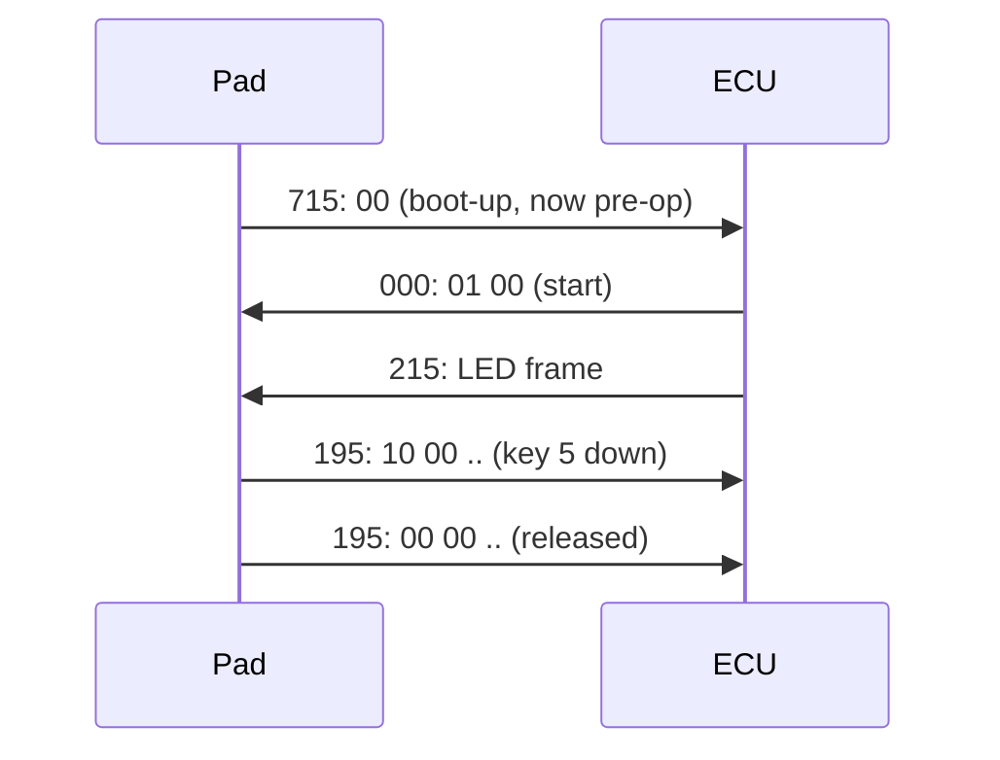

# PKP-2600-SI spec reference (CANopen User Manual rev 1.1)

Condensed from the vendor manual (links in [../../readme.md](../../readme.md)); § numbers
refer to it. `tests/test_keypad_spec_compliance.py` pins our encoders and decoders
to the manual's own example frames.

## Factory defaults (§3) vs what this vehicle needs
| Setting | Default | Needed here | Change via SDO (node 15h → 615h) |
|---|---|---|---|
| Baud rate | **125 kbit/s** | **500 kbit/s** | `2F 10 20 00 02` (§19: 00=1M, 02=500k, 03=250k, 04=125k) |
| Node ID | 15h | 15h | `2F 13 20 00 <id>` (§22) |
| Active on startup | no (needs NMT start) | no; ECU sends NMT start | `2F 12 20 00 01` (§21) |
| Boot-up message | active | **must stay active** (pad-reboot detection) | `2F 11 20 00 01` (§20) |
| Heartbeat | disabled | optional | `2B 17 10 00 <ms LSB> <ms MSB>` (§25) |
| Periodic key state | disabled | not required | `2B 00 18 05 <ms LSB> <ms MSB>` (§41b) |
| Key LED brightness | 3Fh (max) | — | PDO 415h or SDO 2003h/01 |
| Backlight | off, amber | — | PDO 515h, SDO 2003h/02–04 |

A keypad fresh from the factory is silent on this 500 k bus until reconfigured at 125 k.

## COB-IDs (node ID n = 15h)
| ID | Dir | Meaning |
|---|---|---|
| 000h | → pad | NMT: `01 n` start, `02 n` stop, `80 n` enter pre-op, `81 n` reset (n=00 → all nodes) |
| 180h+n = 195h | pad → | key state (TPDO): b0 K8..K1, b1 `0000 K12..K9`, b4 tick timer. Level of every key |
| 200h+n = 215h | → pad | LED ON (RPDO): 36-bit R/G/B bitfield (see [can-protocol.md](can-protocol.md)) |
| 300h+n = 315h | → pad | LED **blink**, same bit layout as 215h. Blink on an already-ON LED = alternate mode |
| 400h+n = 415h | → pad | key LED brightness, b0 00–3Fh |
| 500h+n = 515h | → pad | backlight brightness, b0 00–3Fh |
| 580h+n / 600h+n | ↔ | SDO reply / request (config objects above). The ECU reads 2000h/1 (key levels, §15) after every start |
| 700h+n = 715h | pad → | boot-up (`00`) and heartbeat: `00` boot-up, `04` stopped, `05` operational, `7F` pre-op |

## Behavioral facts the firmware depends on
- Key-state frames are sent **on every press or release** (and every period if §41b
  is enabled). They carry levels, not events, so the ECU must detect rising edges, and
  it must learn which keys are already down after a start (the SDO read of 2000h, §15).
  Bench check: the pad answers that read (`make qa` startup expects `keypad_baseline source=sdo`).
- Boot-up (`715: 00`) means the pad is now in Pre-operational. Key frames and LED
  commands only work once the pad is Operational (after NMT start).
- The heartbeat is off by default, so `7F`/`05`/`04` only arrive if §25 is configured.
  Without it, the boot-up message is the only reboot signal.
- Key LEDs are 1 bit per channel: 7 colors + off. Amber/orange exist only for the backlight.

Related: [can-protocol.md](can-protocol.md), [button-behaviors.md](button-behaviors.md).
