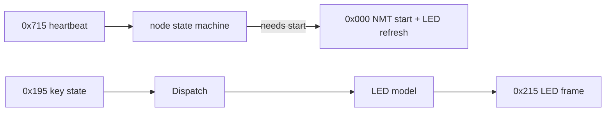

# Keypad domain

The Blink Marine PKP-2600-SI is the driver's only input device. The ECU keeps
the keypad Operational, turns key-state frames into vehicle actions, and owns the
LED model (the pad has no memory of colors across reboots).

- Wire protocol, bit layouts, node state machine: [can-protocol.md](can-protocol.md)
- Per-key behavior and requirement gaps: [button-behaviors.md](button-behaviors.md)
- Vendor manual digest, defaults, required keypad config: [spec-reference.md](spec-reference.md)
