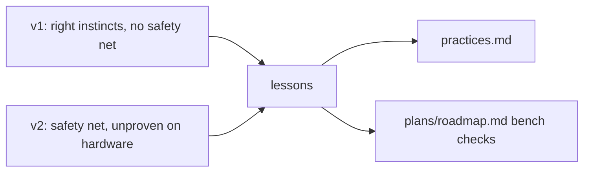

# Lessons learned: the pre-AI and post-AI code

An assessment of the original firmware (v1.0.0, written 2021–2024 without AI help) and the
AI-assisted v2 (2026-09). It holds the lessons that should shape future work and the risks
that are still open. It is not a changelog; git history and PR #9 have the details.

## v1.0.0: what to keep
- **It shipped in a real car.** Small steps, and PRs that explain *why* (#6–#8). That
  history made later archaeology possible ([../vehicle/drive-unit-can.md](../vehicle/drive-unit-can.md)).
- **Good domain instincts, all preserved in v2:**
  - requirements written before code;
  - one outbound CAN frame per tick, so the bus never floods;
  - a **blocking** relay pulse, a safety property
    ([../vehicle/drive-selection.md](../vehicle/drive-selection.md));
  - a throttled gauge against jitter;
  - the DBC signal definition next to its decoder;
  - reprogramming the keypad to 500k over SDO from firmware.
- **Readable:** classes map to physical things (Pad, ParkingBrake, ECU).

## v1.0.0: what hurt (root cause: no off-board harness)
- **Nine real bugs had survived.** Five could crash the firmware or keep keys from working
  (pre-op heartbeat, never-stored toggles, gauge range, short payloads, ECU-only reset).
  The worst could release the brake and pulse DRIVE from a key held through a reset. The
  first CAN-shift version could never transmit (`TypeError`). "It works" meant "it worked once
  on the bench".
- **Hardware in every class**, and the main loop ran at import, so nothing was testable.
- **Dead code next to live code.** Nobody could tell a placeholder from abandoned code.
- **Protocol misread as events, not levels.** The keypad's key-state frame is a level snapshot
  (manual §10). Reading the spec closely would have prevented a whole bug class.
- **Deploy copied only `code.py`**, and there was no way back.

## v2: what improved
- Characterization tests pinned v1 behavior *before* refactoring. Fixes are small `fix:`
  commits that can be reviewed against the original.
- 300+ tests run in about 2 s without hardware. They include the vendor manual's own example frames
  and a simulator replay of the entire `make qa` bench script.
- The hardware is isolated in `mmecu/hardware.py`. Deploy is staged and verified, and
  `make restore` returns to the v1.0.0 tag.
- The Lode lets a future session (human or AI) start informed.

## v2: where to stay skeptical (current risks)
- **Not yet run on the board.** The SDO key-level read, always-on EVT output, RAM use with
  multiple modules, and the USB soft-reset are assumptions until `make qa` passes
  ([../plans/roadmap.md](../plans/roadmap.md) bench checklist).
- **Much larger surface.** One file became a package plus QA harness, deploy tool, tests
  and docs. Each piece was requested, but it is heavier than a keypad strictly needs. Decide
  what will actually be maintained.
- **Tests share the author's understanding of the system.** A misread of the hardware is
  mirrored in the simulator. Spec-derived helpers (`qa/spec.py`) reduce this; only the bench
  removes it.

## Lessons for future work
1. **Build a harness before changing behavior.** No bug fixed in v2 would have survived v1 if
   one had existed.
2. **Read the device spec for semantics, not just bit layouts** (levels vs events, what
   happens after a restart). Put the manual's examples into tests.
3. **Review AI output like human output.** Mistakes that review caught in v2:
   - deleting needed stubs;
   - pointing restore at a moving branch (`master`);
   - repeating the "no keys held" assumption in the first held-key fallback;
   - a gap in the staged deploy;
   - a test that passed for the wrong reason;
   - positional list edits that broke when the list grew.

   Copilot found five real issues over two reviews.
4. **Prove a test fails first,** or show it fails against the old code. Several v2 tests
   passed before their fix and had to be rewritten to discriminate.
5. **Keep placeholders as explicit stubs** (`mmecu/actions.py`), never as unmarked dead code.
6. **Release points must be tags, not branches**, and bench validation gates `v2.0.0`.

Related: [../practices.md](../practices.md), [../testing/summary.md](../testing/summary.md), [../plans/roadmap.md](../plans/roadmap.md).
