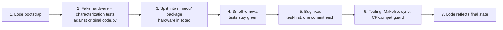

# Plan: tests + smell-free refactor

Branch: `refactor/lode-tests-cleanup`. Each checkpoint is one commit (or a small
group) so any step can be reverted in isolation.

## Guiding rules
- Characterization tests are **black-box**: CAN frames in, CAN frames / pin
  writes / servo angles out. Only the harness adapter (`tests/sim.py`) knows how
  the app is constructed, so the same tests pin behavior before and after the
  refactor.
- Refactor commits must not change observable behavior. Behavior changes land
  as separate `fix:` commits whose test diff shows the old-vs-new behavior.
- Anything touching drive selection or the parking brake stays behavior-identical
  unless the human decides otherwise (see Open questions).

## Status
- [x] 1 Lode bootstrap
- [ ] 2 Test scaffold + characterization
- [ ] 3 Package split
- [ ] 4 Smell removal
- [ ] 5 Bug fixes (pre-op crash, toggle persistence, gauge clamp, short payloads)
- [ ] 6 Tooling
- [ ] 7 Lode final pass

## Open questions for the human (not changed)
1. **Boot drive LEDs**: at boot NEUTRAL is always lit, PARK also lit if the brake
   is engaged, while `drive_state` is always PARK. Pressing PARK when the brake
   was disengaged at boot does not re-light PARK. Intended?
2. **Gauge mapping**: angle = `MAX_ANGLE * fraction` (0..119) ignores
   `MIN_ANGLE` (57). Should it be `MIN + (MAX-MIN) * fraction`?
3. **Hazard blink** (1 s on/off, per requirements) is not implemented; LED is solid.
4. **"Vehicle must be stopped"** before drive/function mode changes is not enforced
   (no speed source yet).
5. F1/F2 only change LEDs; no power/regen commands are sent yet.

See [../keypad/button-behaviors.md](../keypad/button-behaviors.md) for requirement-by-requirement status.
