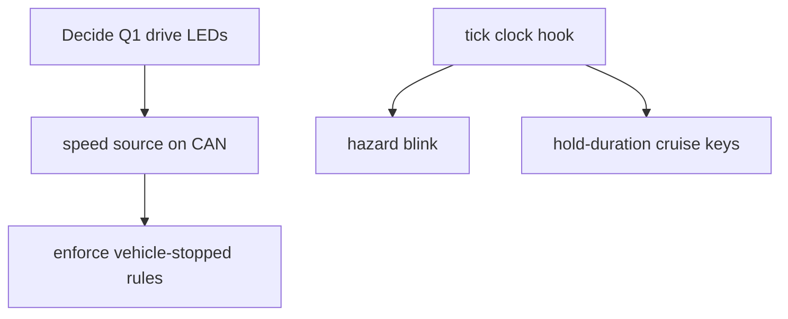

# Roadmap & open questions

## Open questions for the human (current behavior is deliberate until answered)
1. **Startup drive LEDs**: on every keypad (re)start NEUTRAL is lit, PARK also lit
   if the brake is engaged, and `drive_state` is PARK only if the brake is
   engaged; otherwise it keeps its previous value. So after DRIVE → pad reboot,
   the LEDs show NEUTRAL while the car is in DRIVE. At boot with the brake
   released, pressing PARK engages the brake but does not light PARK (it is a
   "no change" from the initial PARK state). Proposed: light exactly the key for
   the actual `drive_state`, and at boot derive the state from the brake
   (engaged → PARK, else NEUTRAL). Pinned by
   `test_pad_reboot_redraws_boot_drive_leds_not_current_selection` and
   `test_park_at_boot_with_brake_disengaged_engages_brake_but_leds_unchanged`.
2. **Gauge mapping**: `angle = MAX_ANGLE * fraction` (0–119°) ignores `MIN_ANGLE`
   (57°), yet the boot needle is centered between them. Should it be
   `MIN + (MAX - MIN) * fraction`?
3. **NEUTRAL with brake engaged**: NEUTRAL does not release the brake (R and D do).
4. **Exception policy**: an unexpected exception still halts `code.py`. Options: a
   catch-all in `code.py` that logs and continues, or `supervisor.reload()`.
   This needs a safety decision.

## Not yet implemented (from REQUIREMENTS.md)
- Hazard blink (1 s on / 1 s off); the LED is solid today. Needs a monotonic-clock
  tick hook in `Application.tick` (don't use sleep, see drive-selection.md).
- "Vehicle must be stopped" before drive/function changes (no speed source yet).
- F1/F2 power + regen commands (LEDs only today); regen toggle; openpilot cruise
  toggle and speed up/down (hold-duration tracking needs key-release edges).
- Exhaust sound hardware.

## Engineering follow-ups
- Precompile `mmecu/` with CircuitPython 7 `mpy-cross` if RAM gets tight on-board.
- CI: run `make check` on pull requests.

Related: [../keypad/button-behaviors.md](../keypad/button-behaviors.md).
