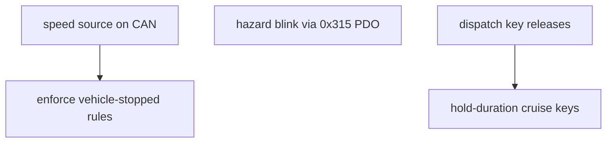

# Roadmap & open questions

## Open questions for the human (current behavior is deliberate until answered)
1. **Gauge mapping**: `angle = MAX_ANGLE * fraction` (0–119°) ignores `MIN_ANGLE`
   (57°), yet the boot needle is centered between them. Should it be
   `MIN + (MAX - MIN) * fraction`?
2. **NEUTRAL with brake engaged**: NEUTRAL does not release the brake (R and D do).
3. **Exception policy**: an unexpected exception still halts `code.py`. Options: a
   catch-all in `code.py` that logs and continues, or `supervisor.reload()`.
   This needs a safety decision.

## Not yet implemented (from REQUIREMENTS.md)
- Hazard blink (1 s on / 1 s off); the LED is solid today. The keypad has a native
  blink PDO (`0x315`, same bit layout as `0x215`, see keypad/spec-reference.md),
  so no ECU timer is needed. Its blink rate is fixed by the pad and unverified
  against the 1 s requirement.
- "Vehicle must be stopped" before drive/function changes (no speed source yet).
- F1/F2 power + regen commands (LEDs only today); regen toggle; openpilot cruise
  toggle and speed up/down (hold-duration tracking needs key-release edges).
- Exhaust sound hardware.

## Engineering follow-ups
- Keypad provisioning: the factory default is 125 kbit/s; this bus is 500 kbit/s. The
  one-time SDO commands are in keypad/spec-reference.md. A small provisioning script
  would make replacing a keypad repeatable.
- Precompile `mmecu/` with CircuitPython 7 `mpy-cross` if RAM gets tight on-board.
- CI: run `make check` on pull requests.

Related: [../keypad/button-behaviors.md](../keypad/button-behaviors.md).
