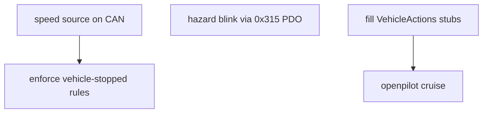

# Roadmap & open questions

## Open questions for the human (current behavior is deliberate until answered)
1. **Gauge mapping**: `angle = MAX_ANGLE * fraction` (0–119°) ignores `MIN_ANGLE`
   (57°), yet the boot needle is centered between them. Should it be
   `MIN + (MAX - MIN) * fraction`?
2. **NEUTRAL with brake engaged**: NEUTRAL does not release the brake (R and D do).
3. **Exception policy**: an unexpected exception still halts `code.py`. Options: a
   catch-all in `code.py` that logs and continues, or `supervisor.reload()`.
   This needs a safety decision.
4. **NMT start scope**: the ECU sends `01 00` (start *all* CANopen nodes). The manual
   also allows `01 15` (keypad only). Both work today; addressing only the keypad avoids
   starting any CANopen device added to the bus later.
5. **Exhaust LED color**: the requirement says solid "(white?)"; the implementation uses
   yellow (as does hazard). REGEN already uses white.

## Needs bench verification (not provable in the simulator)
`make qa` covers the keypad, relays, brake, toggles, holds, keypad reboot and gauge
steps; the items below need extra attention during it.
- Firmware fits in RAM with the multi-module `mmecu/` layout (fallback: `mpy-cross`).
- Boot drive state: with the brake released the ECU *displays* NEUTRAL but cannot read
  the drive unit's actual gear, and pulses no relay. Confirm this is the right display.
- Keypad behavior vs the manual (rev 1.1 is marked "for reference only"): edge-based
  key frames, the Stopped heartbeat, and, before using the blink PDO, what "alternate
  mode" does when blink is sent to an LED that is already ON.
- Stub keys (REGEN, cruise) light their LEDs although nothing reaches the vehicle yet
  (decided by the human; see ../keypad/button-behaviors.md). Make sure drivers/testers know.

## Not yet implemented (from REQUIREMENTS.md)
Every key is handled; these effects are log-only stubs in `mmecu/actions.py`
(`VehicleActions`) waiting for their CAN messages or hardware:
- `set_power_mode` (F1/F2 power + regen levels), `set_regen`, `set_cruise`,
  `adjust_cruise_speed` (openpilot), `set_hazard` (hazard lights), `set_exhaust_sound`.

Still missing beyond the stubs:
- Hazard LED blink (1 s on / 1 s off); the LED is solid today. The keypad has a native
  blink PDO (`0x315`, same bit layout as `0x215`, see keypad/spec-reference.md), so no
  ECU timer is needed. Its blink rate is fixed by the pad and unverified against the
  1 s requirement.
- "Vehicle must be stopped" before drive/power-mode changes (no speed source yet).
- The cruise speed step per held second is the implementer's choice inside
  `adjust_cruise_speed`.

## Engineering follow-ups
- Keypad provisioning: the factory default is 125 kbit/s; this bus is 500 kbit/s. The
  one-time SDO commands are in keypad/spec-reference.md. A small provisioning script
  would make replacing a keypad repeatable.
- Precompile `mmecu/` with CircuitPython 7 `mpy-cross` if RAM gets tight on-board.
- CI: run `make check` on pull requests.

Related: [../keypad/button-behaviors.md](../keypad/button-behaviors.md).
