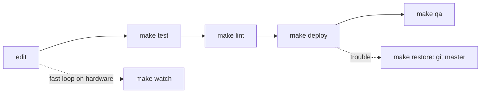

# Dev workflow, deploy & restore



| Command | Does |
|---|---|
| `make setup` | `.venv` with pytest, ruff, pyserial |
| `make test` / `make lint` / `make fmt` | suite / ruff check + format check / autofix |
| `make check` | test + lint |
| `make deploy` | `check`, then deploy the working tree to the board and verify |
| `make restore` | deploy known-good git `REF` (default `master`); asks first |
| `make watch` | `./sync.sh --watch` (fswatch), no tests |
| `make console` | `screen <port> 115200`; `PORT=` overrides |
| `make qa` | guided hardware QA on the real keypad ([../qa/summary.md](../qa/summary.md)); `ARGS=`, `PORT=` |

## Deploy contract (`tools/circuitpy.py`, stdlib only, Python ≥ 3.7)
- **Git is the backup.** The board only runs what is in this repo, so restoring means
  deploying a known-good ref: `make restore` deploys `master` (the original
  single-file firmware) and `make restore REF=<tag/sha>` deploys any other ref.
  `python -m tools.circuitpy deploy --ref X` does the same without the prompt. Refs
  are exported with `git archive` (committed content only, never uncommitted edits).
- Drive: `--drive` / `$CIRCUITPY` if given; it is **never** swapped for an
  auto-detected drive. Otherwise the tool tries `/Volumes/CIRCUITPY`,
  `/run/media/$USER/CIRCUITPY` and `/media/$USER/CIRCUITPY`.
- It refuses any directory without `boot_out.txt`, so a typo'd path can't be written to.
- Copies `lib/`, then replaces `mmecu/` wholesale. It removes `mmecu/` if the source
  has none (the legacy layout), so switching layouts leaves no strays. It writes
  `code.py` **last**, because that triggers CircuitPython's auto-reload.
- Every written file is re-read and compared (sha256) with its source.
- Other drive files (client notes, `boot_out.txt`, hidden OS files) are never touched.
- Limitation: files on the board that were never committed cannot be restored. Copy
  the drive to a folder by hand once before the first deploy on an unknown board.

```bash
CIRCUITPY=/mnt/CIRCUITPY make restore REF=v1.0
```

Related: [hardware.md](hardware.md), [../testing/summary.md](../testing/summary.md).
