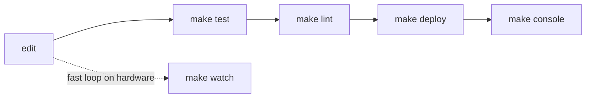

# Dev workflow & deployment



| Command | Does |
|---|---|
| `make setup` | `.venv` with pytest + ruff |
| `make test` / `make lint` / `make fmt` | suite / ruff check + format check / autofix |
| `make check` | test + lint |
| `make deploy` | `check`, then `./sync.sh` |
| `make watch` | `./sync.sh --watch` (fswatch), no tests |
| `make console` | `screen <port> 115200`; `PORT=` overrides |
| `make qa` | guided hardware QA on the real keypad ([../qa/summary.md](../qa/summary.md)); `ARGS=`, `PORT=` |

## Deploy contract (`sync.sh`)
- Finds the drive via `$CIRCUITPY`, `/Volumes/CIRCUITPY`, `/run/media/$USER/CIRCUITPY`
  or `/media/$USER/CIRCUITPY`.
- Copies `lib/`, then replaces `mmecu/*.py` (never `__pycache__`), then writes
  `code.py` **last**. Writing `code.py` triggers CircuitPython's auto-reload, so
  the whole tree must already be in place.

```bash
CIRCUITPY=/mnt/CIRCUITPY ./sync.sh
```

Related: [hardware.md](hardware.md), [../testing/summary.md](../testing/summary.md).
