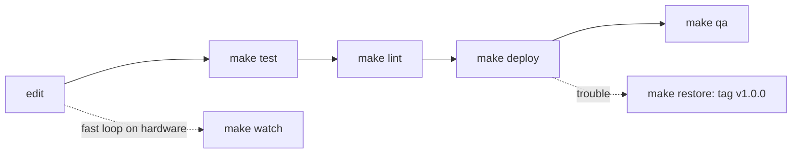

# Dev workflow, deploy & restore



| Command | Does |
|---|---|
| `make setup` | `.venv` with pytest, ruff, pyserial |
| `make test` / `make lint` / `make fmt` | suite / ruff check + format check / autofix |
| `make check` | test + lint |
| `make deploy` | `check`, then deploy the working tree (or `REF=<tag>`) to the board and verify |
| `make restore` | deploy known-good release tag `REF` (default `v1.0.0`); asks first |
| `make watch` | `./sync.sh --watch` (fswatch), no tests |
| `make console` | `screen <port> 115200`; `PORT=` overrides |
| `make qa` | guided hardware QA on the real keypad ([../qa/summary.md](../qa/summary.md)); `ARGS=`, `PORT=` |

## Deploy contract (`tools/circuitpy.py`, stdlib only, Python ≥ 3.7)
- **Git is the backup.** The board only runs what is in this repo, so restoring means
  deploying a known-good **release tag**: `make restore` deploys `v1.0.0` (the original
  single-file firmware) and `make restore REF=<tag/sha>` deploys any other ref.
  `python -m tools.circuitpy deploy --ref X` does the same without the prompt. Refs
  are exported with `git archive` (committed content only, never uncommitted edits).
- Invariant: `RESTORE_REF` is a tag, never a branch. `master` moves when PRs merge, so
  "restore master" would silently stop meaning "go back". A test enforces this.
- Releases are annotated tags. `v1.0.0` is the original single-file firmware (master @
  `c205613`). `v2.0.0-rc.1` is the mmecu branch awaiting hardware QA. Bench fixes become
  `-rc.2`, and so on. `v2.0.0` goes on the master merge commit once `make qa` passes.
  Deploy a release with `make deploy REF=<tag>`, so the QA report names an exact build.
- Drive: `--drive` / `$CIRCUITPY` if given; it is **never** swapped for an
  auto-detected drive. Otherwise the tool tries `/Volumes/CIRCUITPY`,
  `/run/media/$USER/CIRCUITPY` and `/media/$USER/CIRCUITPY`.
- It refuses any directory without `boot_out.txt`, so a typo'd path can't be written to.
- **Staged, never half-installed.** Everything is first copied into the hidden
  `.mmecu-staging/` folder on the drive and verified (sha256). Any failure there (disk
  full, unplugged, bad write) removes the staging folder and leaves the running firmware
  untouched. Only then is it swapped in by renames: `lib/` files, the whole `mmecu/`
  directory, and `code.py` **last**.
- For the legacy layout (no `mmecu/` in the source), `code.py` is replaced *before*
  `mmecu/` is removed, so the board never holds a `code.py` that imports a missing package.
- CircuitPython auto-reloads after *any* write to the drive, not just `code.py`. While
  staging, a reload only restarts the old, intact firmware.
- Installed files are verified again after the swap. A leftover staging folder from an
  interrupted run is removed on the next deploy.
- **Residual swap windows (milliseconds, between renames), with how each recovers:**
  - The old `mmecu/` is parked as `.mmecu-staging/retired-mmecu`, and the new one is not yet
    renamed in. This is the only unbootable state. An error there is rolled back at once
    (`previous firmware restored`). If the process died (unplug), the next
    `deploy`/`restore` runs `repair_interrupted_swap` first and prints "Found an
    interrupted deploy…".
  - The new `mmecu/` is in place but `code.py` is still the previous one. It boots,
    because `code.py` is only import, build and loop. Re-running completes it.
  - A truly atomic switch would need versioned package folders plus a `code.py` that sets
    `sys.path`. Rejected for now (2026-09-28): it changes the on-board layout, and the
    windows above are recoverable.
- Other drive files (client notes, `boot_out.txt`, hidden OS files) are never touched.
- Limitation: files on the board that were never committed cannot be restored. Copy
  the drive to a folder by hand once before the first deploy on an unknown board.

```bash
CIRCUITPY=/mnt/CIRCUITPY make restore REF=v1.0.0
```

Related: [hardware.md](hardware.md), [../testing/summary.md](../testing/summary.md).
