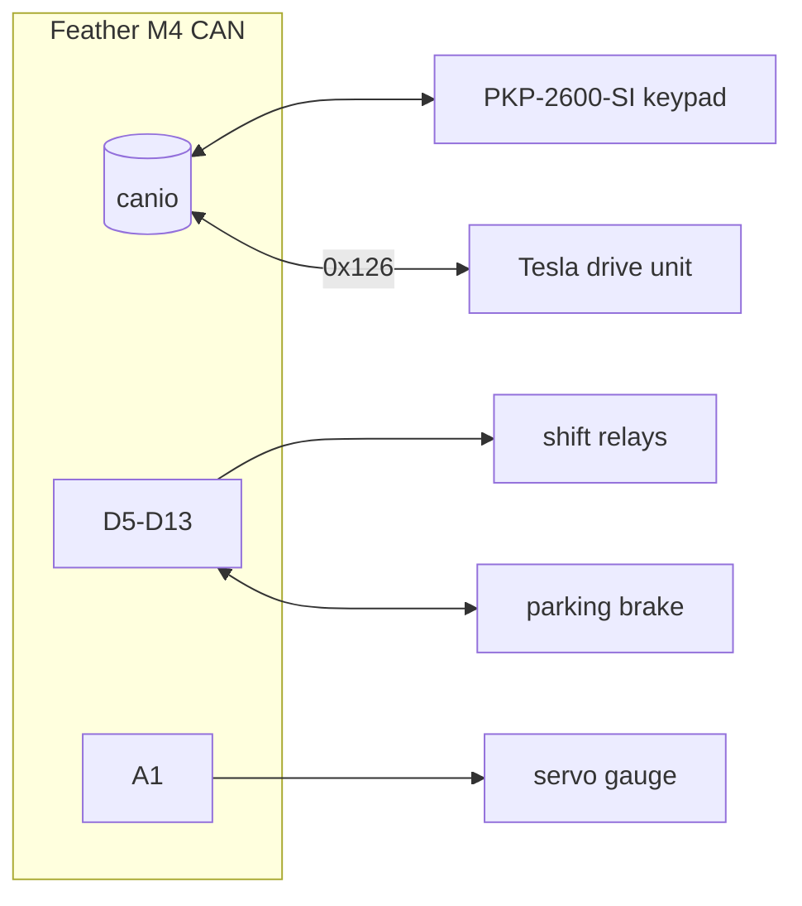

# Hardware & runtime platform

- Board: Adafruit Feather M4 CAN (SAME51J19A), `board_id=feather_m4_can`.
- Runtime: **CircuitPython 7.0.0** (see `boot_out.txt`, written by the board).
- CAN: `canio.CAN(rx=board.CAN_RX, tx=board.CAN_TX, baudrate=500_000, auto_restart=True)`.
  At boot, `CAN_STANDBY` is driven low and `BOOST_ENABLE` high when present.
- Vendored library: `lib/adafruit_motor/*.mpy` (servo).

## Pin map (constants in `mmecu/hardware.py`)
| Pin | Direction | Function |
|---|---|---|
| D11 | out | reverse relay (pulse) |
| D12 | out | neutral relay (pulse) |
| D13 | out | drive relay (pulse) |
| D10 | in, pull-up | parking brake engaged sensor |
| D9 | in, pull-up | parking brake disengaged sensor |
| D6 | out | parking brake engage trigger (held) |
| D5 | out | parking brake disengage trigger (held) |
| A1 | PWM 50 Hz | battery gauge servo |

## CircuitPython constraints (contract for all firmware code)
- Missing modules: `typing`, `dataclasses`, `enum`, `abc`, `functools`, `itertools`.
- An uncaught exception ends `code.py` and the board sits idle. Every handler on
  the CAN path must tolerate malformed input.
- ~192 KB RAM: avoid per-tick allocations; logging f-strings are built even when
  filtered, so keep hot-path logs cheap.
- `code.py` runs as `__main__` with the board root and `lib/` on the import path.

Deployment and dev loop: [dev-workflow.md](dev-workflow.md).
