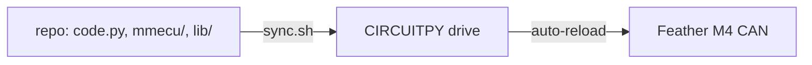

# Platform

The Feather M4 CAN runs CircuitPython 7. This folder covers the board, pins,
language constraints and how firmware reaches the board.

- [hardware.md](hardware.md): board, pin map, CircuitPython constraints
- [dev-workflow.md](dev-workflow.md): make targets, deploy contract
