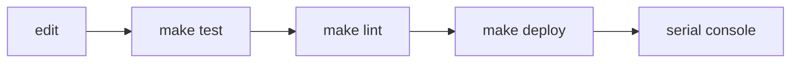

# Practices

## Firmware code
- Target **CircuitPython 7** (a MicroPython subset). No `typing`, `dataclasses`,
  `enum`, `abc`, `functools`, `itertools`, type annotations, walrus, or `match`.
  `tests/test_circuitpython_compat.py` enforces an import allowlist and bans those
  syntax nodes.
- Only `code.py` and `mmecu/hardware.py` import CircuitPython hardware modules
  (`board`, `canio`, `digitalio`, `pwmio`, `adafruit_motor`). Everything else takes
  plain objects (anything with `.value`, `.angle`, `send()`), so it runs on CPython.
- Never let an exception escape a CAN handler: an uncaught exception halts the car's
  keypad. Validate payload length and log instead.
- Keep log calls on the hot path cheap. Use `log.debug(...)` sparingly and don't
  add per-method trace logs.
- Constants live next to the code that owns them (CAN IDs in the protocol module,
  pins in `hardware.py`).
- Every new observable behavior emits a `log.event(...)` and gets a QA step in
  `qa/steps.py` (see [qa/summary.md](qa/summary.md)). Event values must not contain spaces.

## Tests
- Black-box behavior tests go through `tests/sim.py` (`Sim` = app + fake hardware).
  Assert on observable outputs: decoded LED colors, relay pulses, brake outputs,
  servo angle, CAN frames.
- Pure-logic unit tests (bit packing, decoding) sit next to them and import
  `mmecu` modules directly.
- Fake CircuitPython modules live in `tests/fakes/` and are put on `sys.path` by
  `tests/conftest.py`. Fakes mimic real failure modes (for example, the servo raises
  `ValueError` outside 0–180).
- Behavior changes are committed as `fix:` with the test change in the same commit.

## Workflow
- `make test` / `make lint` before each commit; `make deploy` copies firmware to
  the board. See [platform/dev-workflow.md](platform/dev-workflow.md).

