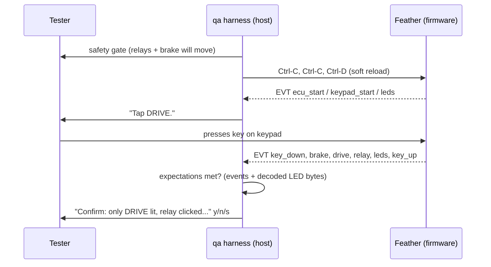

# Hardware QA harness

`make qa` (`python -m qa`) is a guided bench test on the real Feather, keypad and
vehicle I/O. It soft-resets the board over USB serial, tells the tester what to
press or hold, checks the firmware's structured events, asks the tester to confirm
what only a human can see (LED colors, relay clicks, brake, gauge), and writes a
report to `qa-reports/qa-<timestamp>.md` (git-ignored). The exit code is 1 if any step failed.



## Firmware event contract (`mmecu/log.py: log.event`)
Each event is one line, `EVT <name> key=value ...`, with no spaces in values. Events are
always on (human-rate) and go to `print` by default. Tests capture them with
`log.set_event_sink`.

| Event | Fields | Emitted by |
|---|---|---|
| `ecu_start` | `drive`, `brake` (0/1) | app, first keypad start |
| `keypad_start` | `reason` (node state before start) | app, every NMT start |
| `keypad_state` | `state` | keypad heartbeat change |
| `keypad_baseline` | `source` (sdo/timeout), `keys` (e.g. `1,9` or `none`) | keypad, when the post-start key baseline is set |
| `leds` | `payload` (5-byte hex) | app, every LED frame queued |
| `key_down` / `key_up` | `key` (1–12), `held` (s, key_up) | controller |
| `drive` | `state` | controller, on drive-state change |
| `relay` | `state` | shifter, after each pulse |
| `brake` | `engaged` | parking brake, on change |
| `hazard` `exhaust_sound` `regen` `cruise` | `on` | controller toggles |
| `power_mode` | `mode` (low/high) | controller F1/F2 |
| `cruise_adjust` | `direction`, `held` | controller, speed-key release |
| `gauge` | `fraction`, `angle` | battery gauge move |
| `can_bus` | `state` | app, bus state change |

Rule: a new observable behavior should get an event and a QA step.

## Step contract (`qa/steps.py`)
- `instruction` is shown to the tester.
- `do` is the same thing in machine form: `hold(*keys)`, `release()`, `wait(s)`,
  `reboot_pad()`, `hv_bus(v)`, `reset_ecu()`. On hardware only `reset_ecu` is automated.
- `expect` holds the checks:
  - `Saw(name, **fields)`: a field may be a predicate such as `at_least(1.0)`.
  - `Count(n, name, ...)`
  - `Leds(colors or ctx->colors)`: judges the *latest* LED frame, sent in any step.
  - `State(drive=, brake=)`
  - `Count`, `Leds` and `State` are judged after a 1 s settle.
- `confirm` is a y/n/s question and may use `{drive}` / `{brake}` from the context.
- `target` holds the context values a non-idempotent step drives the vehicle to (toggles:
  `{"hazard": 1}`). If they already hold when the step starts, as on a retry after the
  toggle worked but the tester answered "no", the action is skipped and only the final
  checks (`State`, `Leds`) run, so a retry never toggles back. The context tracks toggles
  from their events and resets them on `ecu_start`.
- `ready` is an optional question asked *before* `do` runs, for example "Are you holding
  HAZARD?" before the automated reset in `held-through-reset`.
- `optional=True` records a SKIP instead of a FAIL when no events arrive (the gauge
  without the drive unit).
- A traceback or `level=3` line at any time, even between steps, fails the step.
  On failure the tester chooses continue, retry or quit.

```python
Step("regen-on", "toggles", "Tap REGEN to turn regen on.", tap("REGEN"),
     [Saw("regen", on=1), Leds({"REGEN": "white"})],
     confirm="Confirm: REGEN is lit white.")
```

## Guarantees from the test suite
- `tests/test_qa_harness.py` replays **the whole QA script** on the simulator through a
  virtual tester (`SimActor`), with the brake both engaged and disengaged. If the firmware
  drifts from the script, `make test` fails instead of the bench session.
- It also checks that every key is exercised, that step ids are unique, and the
  failure, skip, safety-abort, quit and traceback paths.
- `tests/test_qa_serial.py` runs `SerialConsole` over a pty (line assembly, timeout,
  the reset control bytes).
- `tests/test_events.py` checks the event format and that the `leds` event bytes equal
  the CAN frame.

## Usage
```bash
make qa                                  # full run, auto-detects the Feather (USB VID 239A)
make qa ARGS="--only drive,cruise -v"    # subset (startup always runs), show all events
make qa ARGS="--list"                    # print the steps
PORT=/dev/ttyACM0 make qa
```
Close `make console`/`screen` first; only one program can hold the port.

Related: [../testing/summary.md](../testing/summary.md), [../keypad/button-behaviors.md](../keypad/button-behaviors.md),
[../plans/roadmap.md](../plans/roadmap.md) (bench checks).
