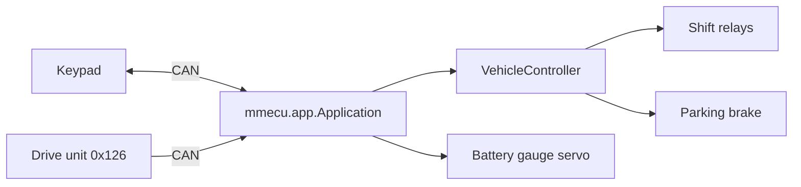

# mm-ecu summary

mm-ecu is CircuitPython 7 firmware for an Adafruit Feather M4 CAN board. The board
is the auxiliary ECU of an EV conversion that uses a Tesla drive unit. On a
500 kbit/s CAN bus it keeps a Blink Marine PKP-2600-SI 12-key keypad Operational,
turns key presses into vehicle actions, and drives the keypad's RGB LEDs.
Vehicle actions include drive selection through pulsed shift relays, a two-sensor
parking brake, and toggles for hazard, exhaust sound and F1/F2 performance modes.
The firmware also decodes the drive unit's HV bus voltage (`0x126`) onto a servo
battery gauge. Logic lives in the hardware-free `mmecu/` package, and `code.py` is
only the boot and main-loop entrypoint. A pytest suite runs the whole app against
fake CircuitPython modules, so development can iterate without the board. Regen,
cruise/openpilot, hazard blinking and the "vehicle must be stopped" rules are still
unimplemented (see [plans/](plans/)).

