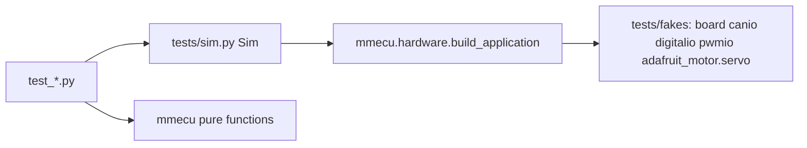

# Testing

`make test` runs the full suite on CPython in about 0.1 s with no board attached.



## Layers
- **Black-box behavior** (`test_keypad_lifecycle`, `test_drive_selection`,
  `test_toggles_and_modes`, `test_battery_gauge`): drive a `Sim` with CAN frames.
  Assert on decoded LED colors, relay pulses, brake outputs, servo angle and
  CAN frames. These tests pinned behavior across the package refactor.
- **Spec compliance** (`test_keypad_spec_compliance`): the PKP-2600-SI manual's own
  example frames (§ numbers cited). If one fails, the firmware disagrees with the vendor.
- **Protocol units** (`test_protocol_units`): LED encoding for every key × color,
  key decoding, frame padding, voltage decode, clamping and heartbeat states.
- **Entrypoint** (`test_entrypoint`): runs `code.py` with `runpy` and a stub app
  that stops after 3 ticks.
- **CircuitPython guard** (`test_circuitpython_compat`): import allowlist,
  hardware imports only in `code.py`/`hardware.py`, no annotations, walrus or `match`.

## Sim API
```python
sim = Sim(brake="engaged").boot()      # engaged | disengaged | invalid | both
sim.press("DRIVE")                      # tap: press frame + release frame, like the pad
sim.hold("DRIVE", "F1")                 # level frame for exactly these keys (no release)
sim.heartbeat("boot_up"); sim.hv_bus(362.5, count=1)
sim.lit()        # {"DRIVE": "blue"}  decoded from the last LED frame
sim.pulses()     # [("DRIVE", 0.5)]   relay high time from the fake clock
sim.brake_outputs(); sim.gauge.angle; sim.sent(can_id)
```
The protocol helpers in `sim.py` (`key_state_payload`, `decode_leds`,
`hv_bus_payload`) are written from the spec, independently of `mmecu`.

## Fakes contract
- Fakes reproduce the real failure modes. The servo raises `ValueError` outside
  0–180, the listener honors `Match` filters, `send` rejects payloads over 8 bytes,
  and an unset input reads True (pull-up).
- `conftest.py` resets fake state before every test.

## Lessons
- **`code.py` shadows the stdlib `code` module.** pytest/pdb import `code`. If
  the repo root is on the front of `sys.path`, the firmware's infinite main loop
  starts and pytest hangs. Hence `--import-mode=importlib`, and `conftest.py`
  imports stdlib `code` first and *appends* paths. Always run `.venv/bin/pytest`
  (or `make test`), never `python -m pytest` from the repo root.
- Bug fixes are proven with a test that fails first. Known bugs can sit as
  `xfail(strict=True)` tests describing the intended behavior, so a fix flips them.

Related: [../practices.md](../practices.md), [../architecture/summary.md](../architecture/summary.md).
