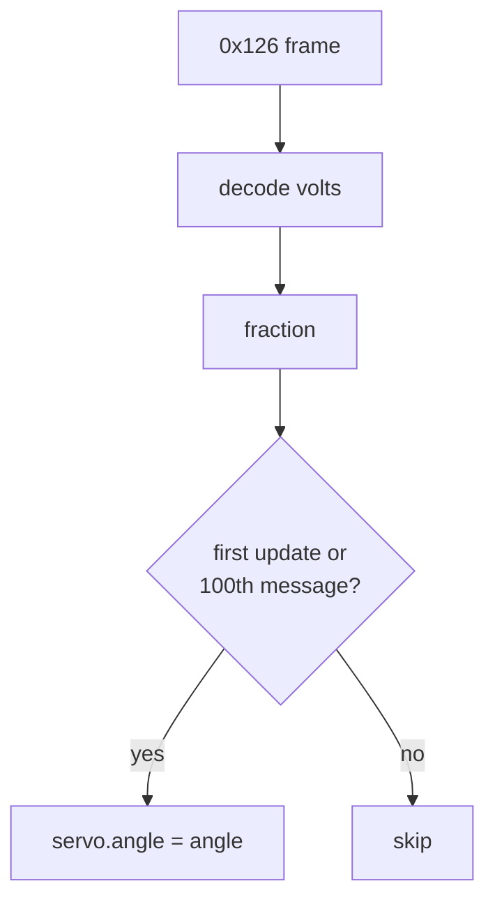

# Battery gauge

A hobby servo on A1 (50 Hz PWM, 500–2500 µs pulse, 0–180° range) acts as the
state-of-charge needle, driven from the Tesla drive unit's HV bus voltage.

## Source signal
```
BO_ 294 DI_hvBusStatus: 3 VEH        (0x126)
  SG_ DI_voltage : 0|10@1+ (0.5,0) [0|500] "V"
  SG_ DI_current : 10|11@1+ (1,0) [0|2047] "A"
```
```python
volts = ((data[1] & 0x03) << 8 | data[0]) * 0.5
fraction = (volts - 325) / (400 - 325)  # MIN/MAX_BATTERY_VOLTAGE (TODO: calibrate)
angle = 119 * fraction  # MAX_ANGLE * fraction
```

## Update throttling
0x126 arrives many times per second; moving the servo each time jitters it.
The gauge moves on the first message after boot and then on every 100th message.
At boot (before any message) the needle is centered at `(57+119)/2 = 88°`.



## Invariants
- The adafruit servo raises `ValueError` for angles outside 0–180, which would halt
  `code.py`. The fraction must therefore be clamped to [0, 1] before mapping.
- Open question: `MIN_ANGLE` (57) is not used in the mapping; see
  [../plans/refactor-plan.md](../plans/refactor-plan.md).

Related: [../platform/hardware.md](../platform/hardware.md).
