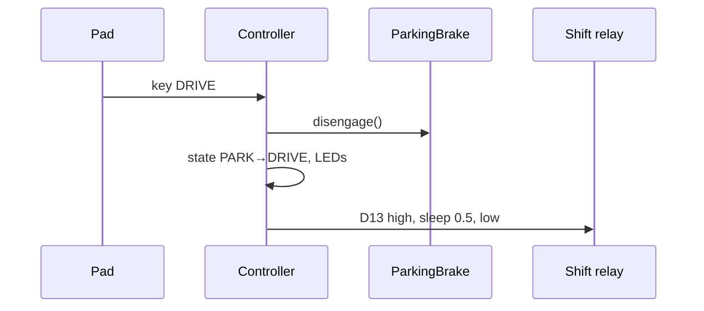

# Drive selection & parking brake

## Drive states
`PARK`, `REVERSE`, `NEUTRAL`, `DRIVE` form a radio group on keys 2–5. Exactly one
of the four drive LEDs is blue after any drive key press.

| Key | Relay pulse | Parking brake |
|---|---|---|
| PARK | none | engage |
| REVERSE | D11 | disengage |
| NEUTRAL | D12 | unchanged |
| DRIVE | D13 | disengage |

A relay pulse is `True`, **blocking** `sleep(0.5)`, `False`. The relay command is
sent on every press, even if the state is unchanged; LEDs only change when the
state changes.

Invariant / rationale: the pulse is deliberately blocking. A non-blocking pulse
would allow two shift relays to be high at once if keys are pressed within
0.5 s. Do not "optimize" this away without a lockout.



## Parking brake
Two sensor inputs (pull-up) and two level-held trigger outputs:

| Pin | Role |
|---|---|
| D10 | sensor: engaged (input, pull-up) |
| D9 | sensor: disengaged (input, pull-up) |
| D6 | trigger engage (output, held) |
| D5 | trigger disengage (output, held) |

```python
def engage(self):
    if not self.engaged:
        self.disengage_out.value = False
        self.engage_out.value = True
        self.engaged = True
```
Boot: if the engaged sensor reads high → `engage()`; elif disengaged sensor high →
`disengage()` (a no-op since `engaged` starts False, so triggers stay low);
else log an error. Both high (e.g. unplugged, pull-ups) → treated as engaged.

## Boot LEDs (current behavior, see open question 1 in
[../plans/refactor-plan.md](../plans/refactor-plan.md))
NEUTRAL is always blue; PARK is blue iff the brake is engaged; `drive_state` is PARK.

Related: [../keypad/button-behaviors.md](../keypad/button-behaviors.md), [../platform/hardware.md](../platform/hardware.md).
