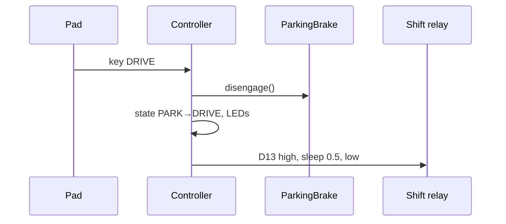

# Drive selection & parking brake

## Drive states
`PARK`, `REVERSE`, `NEUTRAL`, `DRIVE` form a radio group on keys 2–5. Exactly one
of the four drive LEDs is blue after any drive key press.

| Key | Relay pulse | Parking brake |
|---|---|---|
| PARK | none | engage |
| REVERSE | D11 | disengage |
| NEUTRAL | D12 | unchanged |
| DRIVE | D13 | disengage |

A relay pulse is `True`, **blocking** `sleep(0.5)` (injected), `False`. The relay command is
sent on every press, even if the state is unchanged; LEDs only change when the
state changes.

Invariant / rationale: the pulse is deliberately blocking. A non-blocking pulse
would allow two shift relays to be high at once if keys are pressed within
0.5 s. Do not "optimize" this away without a lockout.



## Parking brake
Two sensor inputs (pull-up) and two level-held trigger outputs:

| Pin | Role |
|---|---|
| D10 | sensor: engaged (input, pull-up) |
| D9 | sensor: disengaged (input, pull-up) |
| D6 | trigger engage (output, held) |
| D5 | trigger disengage (output, held) |

```python
def engage(self):  # mmecu/parking_brake.py
    if not self.engaged:
        self._disengage_out.value = False
        self._engage_out.value = True
        self.engaged = True
```
Boot: if the engaged sensor reads high → `engage()`; elif disengaged sensor high →
`disengage()` (a no-op since `engaged` starts False, so triggers stay low);
else log an error. Both high (e.g. unplugged, pull-ups) → treated as engaged.

## Drive LEDs (`VehicleController.show_drive_state`)
Invariant: exactly one drive key is lit, and it is the key for `drive_state`.
- Boot: `drive_state` = PARK if the brake sensors report engaged, else NEUTRAL.
  This is display state only; no relay is pulsed at boot.
- A keypad (re)start redraws the current `drive_state` without resetting it. For
  example, NEUTRAL with the brake engaged stays NEUTRAL after a pad reboot.

```python
def show_drive_state(self):
    for drive_state, key in DRIVE_KEYS.items():
        self.keypad.set_color(key, DRIVE_COLOR if drive_state == self.drive_state else Color.BLACK)
```

Code: `mmecu/drivetrain.py` (`Shifter`), `mmecu/parking_brake.py`,
`mmecu/controller.py` (`select_*`, `_change_drive_state`).

Related: [../keypad/button-behaviors.md](../keypad/button-behaviors.md), [../platform/hardware.md](../platform/hardware.md).
