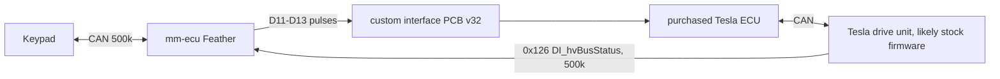
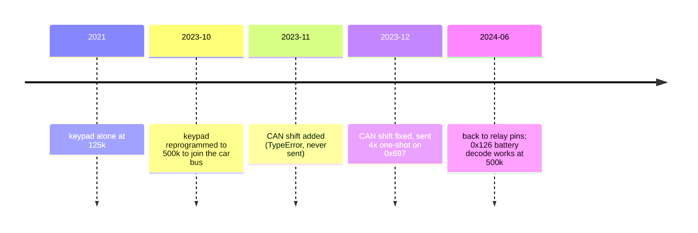

# Drive-unit CAN: bus speed, and why CAN shifting failed

Drive selection uses relay pulses on D11–D13 ([drive-selection.md](drive-selection.md)).
Commanding the drive unit over CAN was tried from Nov 2023 to Jan 2024 and abandoned in
June 2024. This file records what is known (from git history and public sources) so the
idea can be revisited without repeating the investigation.

## The drive-unit controller (from history; model not recorded)
The human confirmed (2026-09-28) that a **purchased third-party ECU** controls the drive unit.
Git history, PR descriptions and deleted files never name the product. What they do record:
- It is called the "Tesla ECU" / "Tesla drive controller" (PR #6, `83c7f12` module docstring).
- The Feather reaches it through a **custom interface PCB** ("v32 of the custom PCB designed to
  interface with the controller", PR #7, 2024-06). R/N/D are **0.5 s pulses on three inputs**
  (added in `86d6d96`, 2024-06; the 2021–22 code only changed LED colors).
- The bus carries `0x126` in **Tesla's own DI_hvBusStatus format** (DBC `BO_ 294`; real
  values confirmed in PR #8). `DI_*` is Tesla's drive-inverter message family. An openinverter
  replacement board sends its own CAN map instead, so the drive unit most likely runs **stock
  Tesla firmware**, with the purchased ECU emulating the car to it. This is an inference: the ECU
  could also re-broadcast `0x126`.

## Bus speed: a mismatch is very unlikely to be the cause
- Tesla's vehicle CAN networks, including the powertrain CAN, run at **500 kbit/s**
  (Instructables "Exploring the Tesla Model S CAN Bus"; TMC powertrain CAN thread).
  The openinverter drive-unit firmware also defaults to 500k (`canspeed` default `2=500k`
  in `stm32-sine/include/param_prj.h`).
- The ECU was deliberately moved to 500k *before* the CAN-shift attempt. Commits
  `5e8e5aa`, `b3466dd` and `ea86e6f` (Oct–Nov 2023) send the keypad `615: 2F 10 20 00 02`
  (object 2010h = 500k) at its factory 125k, then reopen the bus at 500k.
- In June 2024 (`f24e07b`, `48bc37a`) the ECU decodes the drive unit's `0x126`
  DI_hvBusStatus at 500k on the same bus and transceiver. CAN needs every node on a
  segment at the same bitrate. A mismatch would show up as error frames or bus-off, not
  as a drive unit that silently ignores one message while the ECU reads its other traffic.

## What was actually sent (git history)
| Period | Commit | Behavior |
|---|---|---|
| 2023-11-18 | `8e03054` | `ECU.can_drive_state_command` added: ID `0x697`, data `0D/0E/0F BE EF` for D/N/R. **It could never send.** `can_data.get(state, lambda: ...)()` calls the returned list, raising `TypeError: 'list' object is not callable` for D, N and R |
| 2023-12-15 → 2024-01-07 | `bed30ab`, `bd35a90` | Call bug fixed. The frame was queued **4×** per press ("4x duplicate CAN message"), padded to 8 bytes (DLC 8) by `CanMessage`, and sent once per tick |
| 2024-06-02 | `86d6d96`, `7f53dcb` | "Re-add pin-based drive change": relays D11–D13. The CAN method stayed as dead code whose `self.can_message_queue` no longer existed; it was removed in the 2026 refactor (`e96be42`) |

## More likely causes (ranked; unverified without the drive-unit controller's config)
1. **The Nov 2023 version could not transmit at all** (TypeError above). Anything tested
   against it failed regardless of bus or receiver.
2. **Protocol, not speed.** A CAN shift command has to be in whatever format the *purchased
   ECU* accepts (if it accepts any; many such controllers take gear on digital inputs).
   `0x697` with `0D/0E/0F BE EF` matches no known message, and the `BE EF` looks like a
   hand-picked placeholder rather than a vendor spec. For comparison:
   - *Stock Tesla drive-inverter firmware* is commonly reported to depend on the car's
     full message set (gateway/vehicle state), not a single command frame. Unverified here.
   - *openinverter board* (a common conversion controller, but unlikely here because of the
     Tesla-format `0x126`; kept as an example of typical CAN-control rules; "can be controlled via CAN or
     via digital and analog inputs"): CAN control is read only from the configured
     `controlid` (default **63 = 0x03F**). The 8-byte frame is laid out as:
     - `pot` in bits 0–11, `pot2` in 12–23, `canio` in 24–29 (`8=Fwd, 16=Rev`), and a
       2-bit counter in 30–31;
     - cruise, a counter copy, regen and a **CRC-8** in the second word.
     - With `controlcheck=1` (the default), a frame with a bad CRC or a non-advancing
       counter is rejected, and more than 5 errors stop updates.
3. **One-shot versus periodic.** openinverter clears `canio` (so forward and reverse drop)
   if no control frame arrives for **500 ms** (`ERR_CANTIMEOUT`). A burst of 4 identical
   frames per key press can at best hold a direction for half a second.
4. **Frame length.** Frames were padded to DLC 8. A receiver configured for a 3-byte
   frame might reject them. Minor.

Note: in openinverter, CAN `Fwd`/`Rev` are ORed with the digital inputs (`din_forward` /
`din_reverse`), which is what the relays drive today. How a 0.5 s pulse is interpreted
depends on `dirmode` (Button versus Switch).

## If CAN shifting is revisited
- Get the purchased ECU's product name and manual (open question in
  [../plans/roadmap.md](../plans/roadmap.md)). The CAN command format, whether commands must
  repeat, and any counter/checksum rules come from there, not from Tesla's DBC.
- For openinverter: send the control frame on `controlid` **periodically** (well under
  500 ms), with incrementing counters and the CRC, and hold Fwd/Rev as levels. Keep
  the blocking relay-pulse invariant's intent: never request two directions at once.
- Sniff the bus first. `0x126` proves the ECU hears the drive unit, so candump-style
  logging of the drive unit's traffic would show whether it reacts to anything.

Sources:
- Instructables, Exploring the Tesla Model S CAN Bus: https://www.instructables.com/Exploring-the-Tesla-Model-S-CAN-Bus/
- TMC, power train CAN communications: https://teslamotorsclub.com/tmc/threads/information-about-power-train-can-communications.44192/
- openinverter LDU wiki: https://openinverter.org/wiki/Tesla_Model_S/X_Large_Drive_Unit_(%22LDU%22)
- openinverter firmware: https://github.com/jsphuebner/stm32-sine (`include/param_prj.h`, `src/vehiclecontrol.cpp`)

Related: [drive-selection.md](drive-selection.md), [battery-gauge.md](battery-gauge.md), [../keypad/spec-reference.md](../keypad/spec-reference.md).
