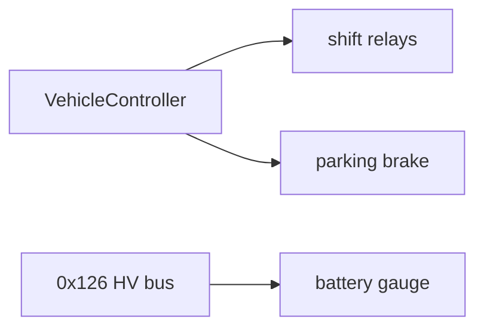

# Vehicle domain

The physical systems the ECU commands or observes.

- [drive-selection.md](drive-selection.md): PRND radio group, relay pulses, parking brake
- [battery-gauge.md](battery-gauge.md): voltage decode, clamping, servo throttling
- [drive-unit-can.md](drive-unit-can.md): Tesla bus speed (500k), the abandoned CAN-shift attempt and why it likely failed
